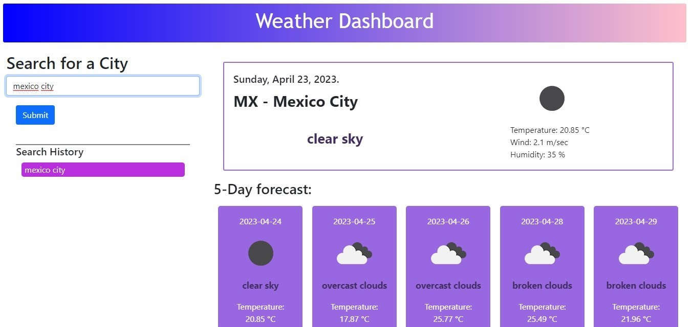

# Weather Dashboard

Weather dashboard that retrieves weather data for cities. Runs in the browser and features dynamically updated HTML and CSS.

## URL of deployed app: https://ximenacu.github.io/Weather-Dashboard-CH6/

## URL of Git Hub: https://github.com/Ximenacu/Weather-Dashboard-CH6

## User Story: 
AS A traveler
I WANT to see the weather outlook for multiple cities
SO THAT I can plan a trip accordingly

## Acceptance Ariteria: 
GIVEN a weather dashboard with form inputs;

* WHEN I search for a city
THEN I am presented with current and future conditions for that city and that city is added to the search history ✅

* WHEN I view current weather conditions for that city
THEN I am presented with the city name, the date, an icon representation of weather conditions, the temperature, the humidity, and the the wind speed. ✅

* WHEN I view future weather conditions for that city
THEN I am presented with a 5-day forecast that displays the date, an icon representation of weather conditions, the temperature, the wind speed, and the humidity. ✅

* WHEN I click on a city in the search history ✅
THEN I am again presented with current and future conditions for that city

### Additionally:
* Use the 5 Day Weather Forecast
* Uses the OpenWeather API to retrieve weather data
* Use localStorage to store any persistent data. 

* Application deployed at live URL. 
* Application loads with no errors.
* Application GitHub URL submitted.  
* Quality  
    * Application user experience is intuitive and easy to navigate.
    * Application user interface style is clean and polished. 
    * Application resembles the mock-up functionality provided in the Challenge instructions. 
* Repository 
    * Repository has a unique name. 
    * Repository follows best practices for file structure and naming conventions. 
    * Repository follows best practices for class/id naming conventions, indentation, high-quality comments, etc.
    * Repository contains multiple descriptive commit messages.
    * Repository contains a high-quality README file with description, screenshot, and link to deployed application. 

